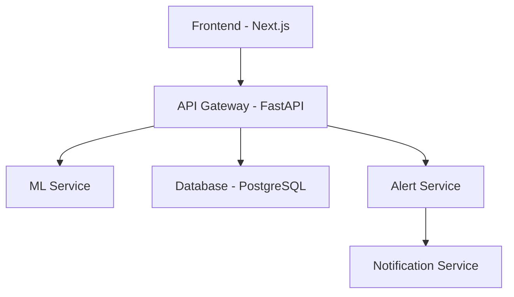
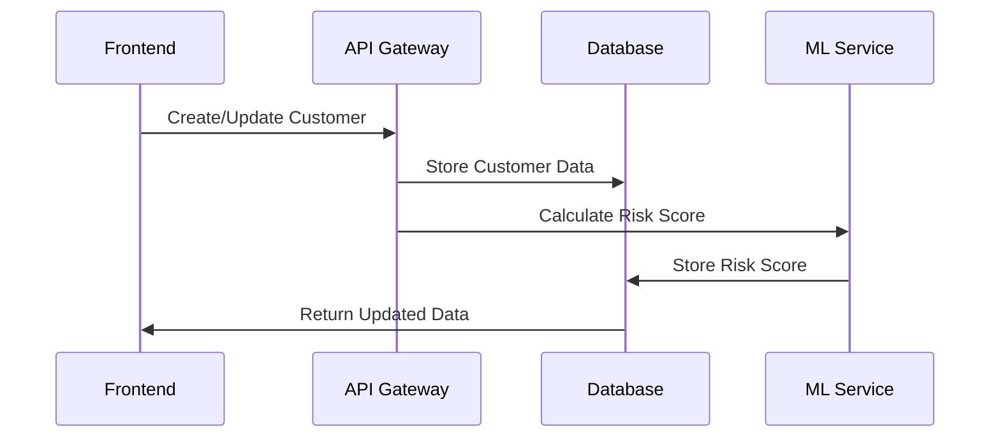
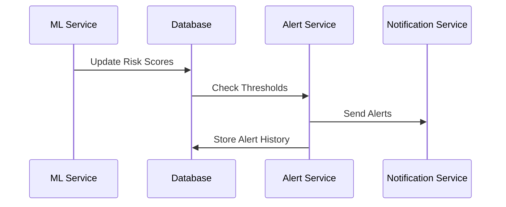

# Architecture Overview

## System Architecture

The Customer Churn Prediction & Risk Monitoring System follows a modern microservices architecture with the following key components:

## Components

### 1. Frontend (Next.js)
- **Technology**: Next.js 14, TypeScript, Tailwind CSS
- **Key Features**:
  - Server-side rendering for optimal performance
  - Real-time data updates using React Query
  - Responsive design with Tailwind CSS
  - Component library using Shadcn UI
  - Type-safe API integration

### 2. API Gateway (FastAPI)
- **Technology**: FastAPI, Python
- **Responsibilities**:
  - Request routing and validation
  - Authentication and authorization
  - Rate limiting
  - API documentation (Swagger/OpenAPI)
  - Error handling

### 3. ML Service
- **Technology**: Python, Scikit-learn
- **Features**:
  - Customer churn prediction
  - Risk score calculation
  - Model training and evaluation
  - Feature engineering
  - Model versioning

### 4. Database (PostgreSQL)
- **Schema**:
  - Customer data
  - Risk scores and history
  - Alert configurations
  - User management
  - Model metadata

### 5. Alert Service
- **Features**:
  - Risk threshold monitoring
  - Alert generation
  - Alert history tracking
  - Statistics and analytics

### 6. Notification Service
- **Channels**:
  - Email notifications
  - Webhook integrations
  - In-app notifications

## Data Flow

1. **Customer Data Management**:

2. **Risk Monitoring**:

## Security

- **Authentication**: Basic Auth with plans to migrate to JWT
- **Authorization**: Role-based access control
- **Data Protection**:
  - HTTPS encryption
  - Input validation
  - SQL injection prevention
  - XSS protection

## Performance Optimizations

1. **Frontend**:
   - Code splitting
   - Image optimization
   - Caching strategies
   - Lazy loading

2. **Backend**:
   - Database indexing
   - Query optimization
   - Connection pooling
   - Caching layer

## Monitoring & Logging

- Application metrics
- Error tracking
- Performance monitoring
- Audit logging
- Alert monitoring

## Future Improvements

1. **Technical**:
   - Implement JWT authentication
   - Add Redis caching layer
   - Set up CI/CD pipelines
   - Add comprehensive testing

2. **Features**:
   - Enhanced ML model features
   - More notification channels
   - Advanced analytics dashboard
   - Batch processing capabilities 